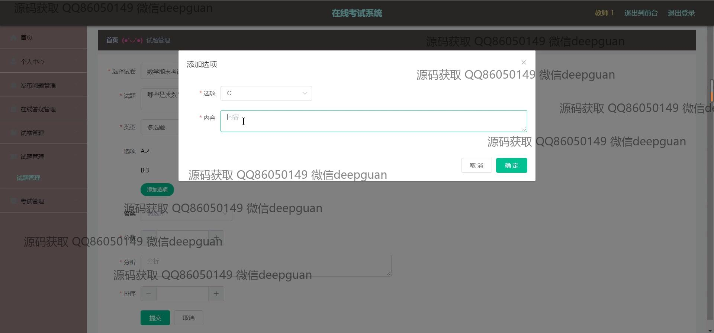
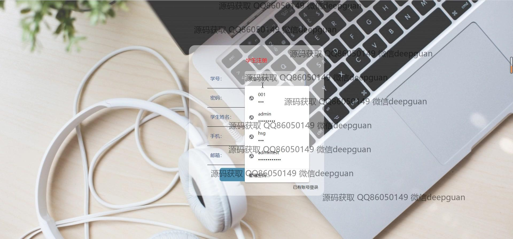
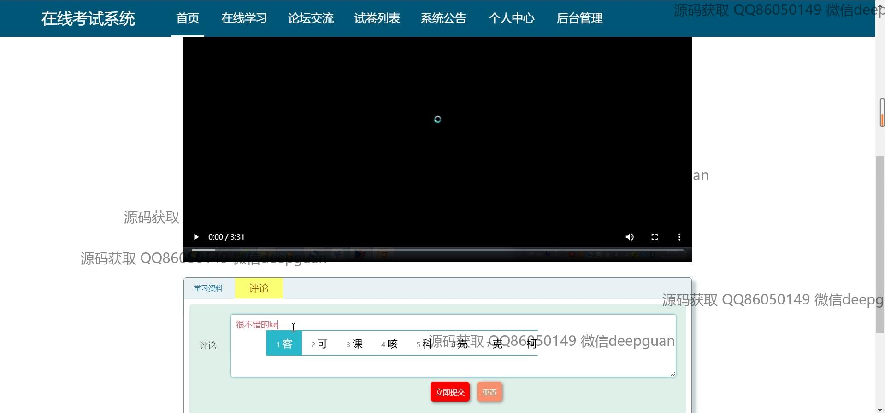

<h1 align="center">的在线考试答疑系统vue</h1>

## 简介
在线考试答疑系统：角色分为学生、教师及管理员；功能模块包括考试管理、答题及答疑功能、学习资源管理、论坛交流及用户管理，旨在提升在线学习体验和考试互动。    --计算机毕业设计源码；毕设源码；java毕业设计源码

## 联系方式

<h3 align="center">获取完整代码与数据库文件 + 微信：deepguan QQ: 86050149 QQ群: 783742310</h3>

<h3 align="center">可帮忙远程部署 包运行成功！提供远程部署、修改代码、设计文档指导、代码讲解等服务！</h3>

## 功能介绍（完整见运行截图）
管理员：主要负责系统设置和用户管理功能，包括教师和学生的注册、信息修改和删除。能够管理系统公告，发布学习资源及管理考试相关的操作，如试卷和试题的创建、编辑与删除，以及对考试的全局监督和调整。

教师：可以登录系统管理个人信息，创建和管理试题、试卷及考试，调整考试时间和形式。参与在线答疑功能，及时回应学生的提问。通过论坛页面与学生互动，并上传学习资料，以辅导学生的学习过程。

学生：登录系统以参与考试，查看考试列表和考试结果，进行试题答疑。通过在线学习模块获取学习资料并记录学习进度。能够在论坛上与教师及其他学生互动，发布和讨论学习中的问题。

访客：可访问系统首页，查看系统公告和一部分公开的学习资源。通过注册功能创建学生或教师账户以获得更高权限使用系统的完整功能。

## 运行截图

本代码来源于网络,仅供学习参考使用!

